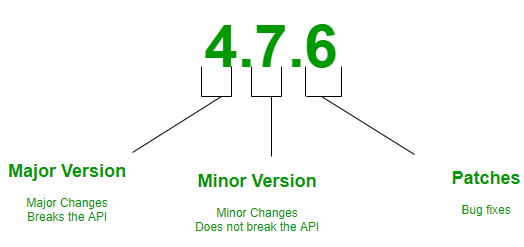

# NPM
> Node Package Manager
>
> NodeJS에서 사용할 수 있는 모듈들을 패키지화하여 모아둔 저장소 역할을 하며 설치/관리를 수행할 수 있는 CLI를 제공한다.
>
> NodeJS 설치 시 자동으로 NPM cli가 설치된다.

# NPM CLI 명령어
- `npm init` : package.json을 생성한다.
- `npm install` : package.json에 명시된 의존성 패키지들을 모두 설치한다.
- `npm install [패키지명]` : 해당 패키지를 설치 후 package.json의 **dependencies**에 추가한다.
- `npm install [패키지명] -g` : 해당 패키지를 전역으로 설치한다.
    - 전역 설치
        - /usr/local/lib/node_modules 혹은 /usr/local/bin에 설치된다. (윈도우의 경우 c:\Users\%USERNAME%\AppData\Roaming\npm\node_modules 에 설치한다.)
        - 여러 프로젝트에서 공통으로 사용된다.
    - 지역 설치
        - 프로젝트 루트의 node_modules 폴더에 설치
        - 해당 프로젝트에서만 사용할 수 있다.
- `npm run [스크립트 이름]` : 해당 이름의 스크립트를 실행한다.

# package.json
```json
{
  "name": "nhnforward-2020-fe",
  "version": "1.0.0",
  "description": "NHN Forward 2020",
  "author": "",
  "private": true,
  "scripts": {
    "start": "webpack-dev-server --config webpack/development.ts --progress",
    "build:alpha": "NODE_ENV=alpha webpack --config webpack/production.ts",
    "build:release": "NODE_ENV=production webpack --config webpack/production.ts",
  },
  "dependencies": {
    "foo": "^4.7.0"
  },
  "devDependencies": {
    "@bar": "^7.11.6"
  }
}
```
|항목|설명|
|---|----|
name | 프로젝트 이름
version | 버전명
description | 프로젝트 설명
author | 제작자
private | 패키지 비공개 여부
scripts | node_modules를 상대경로로 사용하는 스크립트
dependencies | 배포나 번들에 포함되는 패키지들의 실행에 필요한 의존성 정의
devDependencies | 배포나 번들에 포함되지 않는 패키지들의 실행에 필요한 의존성 정의

> package-lock.json (npm version 3 이후 ~)
>
> 패키지들의 버전과 의존성 관계 정의

# Versioning
- semver라는 규칙을 따른다.

1. Major
   - 이전 버전과 호환되지 않으며 새로운 기능 추가가 발생한 경우 이 버전을 변경 
   - 이 경우 Minor랑 Patch는 0으로 초기화
2. Minor
   - 이전 버전과 호환되며 새로운 기능 추가가 발생한 경우 이 버전을 변경
3. Patch
   - 이전 버전과 호환되며 간단한 버그가 수정된 경우 이 버전을 변경

# Tild 와 Caret
1. Tild (~)
    - Minor 버전 명시된 경우 Patch 버전 변경까지만 허용
      - ~1.2.3 &nbsp;=> &nbsp;1.2.x
      - ~1.2&nbsp;&nbsp;&nbsp;&nbsp;&nbsp; => &nbsp;1.2.x
    - Minor 버전 명시 안된 경우 Minor 버전 변경까지만 허용
      - ~1 &nbsp;&nbsp;&nbsp;&nbsp;&nbsp;&nbsp;&nbsp;&nbsp;&nbsp;=> &nbsp;1.x
2. Caret (^)
   - Minor 변경까지 허용
   - 버전이 1보다 큰 경우
      - ^1.2.3 &nbsp;=> &nbsp;1.x
      - ^1.2 &nbsp;&nbsp;&nbsp;&nbsp;&nbsp;=> &nbsp;1.x
      - ^1 &nbsp;&nbsp;&nbsp;&nbsp;&nbsp;&nbsp;&nbsp;&nbsp;&nbsp;=> &nbsp;1.x
    - 버전이 1보다 작은 경우
      - ^0.1.2 &nbsp;&nbsp;=> 0.1.x

# node_module 의존성 탐색 우선순위
- npm v3 이전까지는 하위 의존성을 무조건 하위 디렉토리에 저장한다.
  - `node_modules/a/node_modules/b`
- npm v3 부터 하위 의존성을 최대한 루트 디렉토리에 저장한다.
  - `node_modules/a`
  - `node_modules/b`

# import/require('module') 시 파일 탐색 우선순위
1. require를 한 소스의 폴더에 있는 module 파일
2. require를 한 소스의 폴더에 있는 module.js 파일
3. require를 한 소스의 폴더에 있는 module.json 파일
4. require를 한 소스의 폴더에 있는 module.node 파일
5. 해당 패키지 루트에 있는 node_modules/module 디렉토리 확인
   1. package.json의 main(entry point)에 정의된 파일
   2. index.js
   3. index.json
   4. index.node
6. 해당 패키지의 상위 패키지에서 node_modules/module 디렉토리 확인

## 참조
- https://ooeunz.tistory.com/19
- https://www.zerocho.com/category/NodeJS/post/5825a3caaff5c70018279975
- https://blog.outsider.ne.kr/
- https://code-masterjung.tistory.com/31
- https://ui.toast.com/fe-guide/ko_DEPENDENCY-MANAGE#%EC%9D%98%EC%A1%B4%EC%84%B1-%EB%B2%84%EC%A0%84-%ED%91%9C%EA%B8%B0